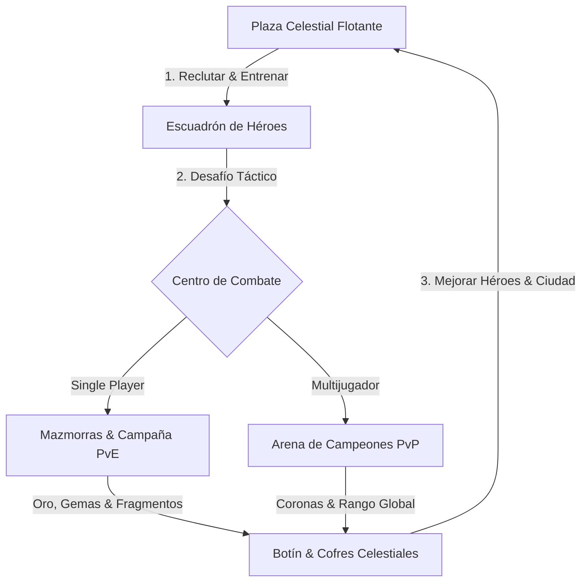

# 📜 BITÁCORA MAESTRA DE DESARROLLO
## REALM OF THE CLOUDS (REINO DE LAS NUBES)
> **Documento Oficial de Arquitectura, Crónica de Desarrollo y Diseño de Juego**  
> **Autor & Creador**: Gustavo Lostte (Wizzard)  
> **Versión**: 2.0 (Pivot Héroes & Combate Táctico)  
> **Fecha de Actualización**: Septiembre 2026  
> **Estado**: Listo para Despliegue y Monetización (PWA / Web3 / Mobile)

---

## 📑 ÍNDICE GENERAL

1. [Ficha Técnica & Métricas del Proyecto](#1-ficha-técnica--métricas-del-proyecto)
2. [Visión, Lore & Premisa del Juego](#2-visión-lore--premisa-del-juego)
3. [Crónica de Evolución & El Gran Giro (Pivote Estratégico)](#3-crónica-de-evolución--el-gran-giro-pivote-estratégico)
4. [El Nuevo Núcleo de Jugabilidad (Core Game Loop)](#4-el-nuevo-núcleo-de-jugabilidad-core-game-loop)
5. [Sistema de Recursos Sagrados (Economía de 3 Ejes)](#5-sistema-de-recursos-sagrados-economía-de-3-ejes)
6. [Sistemas de Combate por Turnos (PvE & PvP)](#6-sistemas-de-combate-por-turnos-pve--pvp)
7. [Sistema de Héroes, Escuadrón & Unidades](#7-sistema-de-héroes-escuadrón--unidades)
8. [Ingeniería de UI/UX: El Nuevo HUD Móvil Ergonómico](#8-ingeniería-de-uiux-el-nuevo-hud-móvil-ergonómico)
9. [Arquitectura de Software, Persistencia & Red](#9-arquitectura-de-software-persistencia--red)
10. [Motor de Audio & Efectos Cinematográficos](#10-motor-de-audio--efectos-cinematográficos)
11. [Internacionalización (i18n en 5 Idiomas)](#11-internacionalización-i18n-en-5-idiomas)
12. [Infraestructura de Monetización & Analítica](#12-infraestructura-de-monetización--analítica)
13. [Inventario de Archivos Clave & Componentes](#13-inventario-de-archivos-clave--componentes)
14. [Hoja de Ruta Futura (Roadmap)](#14-hoja-de-ruta-futura-roadmap)

---

## 1. FICHA TÉCNICA & MÉTRICAS DEL PROYECTO

| Parámetro | Detalle |
|---|---|
| **Nombre del Juego** | *Realm of the Clouds* (Reino de las Nubes / Aetheria Empires) |
| **Género** | RPG Táctico por Turnos + Estrategia de Feudo Flotante |
| **Plataformas Objetivo** | PWA (Mobile First / Android / iOS WebApp), Navegadores de Escritorio |
| **Tecnologías Base** | React 19, Vite 8, Vanilla CSS3 Premium (Candy Aesthetic) |
| **Persistencia** | LocalStorage híbrido offline + Supabase Cloud PostgreSQL Sync |
| **Volumen de Código** | **+70,000 líneas de código** en 50+ componentes modulares |
| **Assets Multimedia** | **740+ archivos** (WebP de alta densidad, atlas de sprites, videos chroma transparentes, audio polifónico) |
| **Idiomas Activos** | Español (ES), Inglés (EN), Portugués (BR), Coreano (KR), etc. |
| **Rendimiento** | 60 FPS estables con modo ECO / FPS regulable en hardware modesto |

---

## 2. VISIÓN, LORE & PREMISA DEL JUEGO

### 2.1 El Universo de las Alturas
En las cúspides olvidadas del cosmos, más allá de la atmósfera de los mortales, flota el **Reino de las Nubes (Aetheria)**: una vasta red de islas celestiales suspendidas por la energía de los **Fragmentos Celestiales**. 

El jugador encarna al **Lord King (Soberano Celestial)**, líder de un feudo flotante que debe reconstruir su imperio, entrenar una orden sagrada de paladines, valkirias y magos cósmicos, y descender a las abismales mazmorras para derrotar a los caudillos orcos y bestias que amenazan con desestabilizar las islas.

### 2.2 Pilares de Identidad
- **Aura Legendaria & Fantasía Épica**: Estética visual radiante, dorados imperiales, cristales arcanos y cielos dinámicos.
- **Acción Inmediata (Zero Friction)**: No requiere instalación pesada ni registro obligatorio; se puede jugar al instante como Invitado con guardado local persistente o vincular correo en la nube.
- **Duelos de Soberanos**: Competencia asíncrona y en tiempo real contra feudos de otros jugadores en el Coliseo.

---

## 3. CRÓNICA DE EVOLUCIÓN & EL GRAN GIRO (PIVOTE ESTRATÉGICO)

### 3.1 El Origen y la Relación con "Toc Foe"
Inicialmente, el motor compartía fundamentos con un título previo denominado *"Toc Foe"*, el cual fue vendido comercialmente a un tercero. Ante la incertidumbre de pago por parte de dicha empresa y con el objetivo primordial de **proteger la propiedad intelectual, diferenciarse al 100% y crear un producto con identidad propia**, se tomó una decisión ejecutiva fundamental: **pivotar el juego**.

### 3.2 Los Grandes Cambios del Pivote (Septiembre 2026):
1. **De City Builder a RPG de Combate por Turnos**: El enfoque principal dejó de ser la gestión pasiva de granjas y minas para convertirse en un **juego de héroes, sinergias y duelos tácticos por turnos (PvP y PvE)**.
2. **Deconstrucción del HUD Clásico**: Se eliminó por completo el `BottomDock` tradicional (una barra inferior saturada de 10 iconos pequeños) que imitaba a los constructores de base de hace una década.
3. **Controles Diestros Móviles (3 Botones Grandes)**: Se implementó un trío de botones flotantes optimizados ergonómicamente para el pulgar del usuario móvil:
   - ⚔️ **Batalla (PvP / PvE)**
   - 🛡️ **Héroes (Escuadrón)**
   - 🏰 **Reino (Cámara de Gobierno)**
4. **Trinidad Económica Sagrada**: Reducción drástica de la fricción económica. En lugar de una confusa maraña de madera, piedra, comida, población, maná y oro, el juego se consolidó en **3 Recursos Maestros**:
   - **Oro** 🪙 (moneda base de entrenamiento y mejoras)
   - **Gemas** 💎 (divisa premium del bazar y aceleraciones)
   - **Fragmentos Celestiales** ✨ (energía mística para evolución de héroes y artefactos)

---

## 4. EL NUEVO NÚCLEO DE JUGABILIDAD (CORE GAME LOOP)



1. **Gestión del Feudo Flotante**: Cosecha rápida de tributos, desarrollo de cuarteles y templos en la isla.
2. **Preparación del Escuadrón**: Selección de paladines, magas arcanas, arqueras y el Rey Comandante, equipando reliquias y asignando pociones.
3. **Despliegue en Batalla**:
   - **PvE**: Incursiones en mazmorras con sistema de aguja/precisión táctica y enfrentamientos cinemáticos contra jefes.
   - **PvP**: Asaltos tácticos al coliseo contra las formaciones de otros soberanos, escalando desde la Liga de Bronce hasta Soberano Celestial.
4. **Recompensas & Ascenso**: Acumulación de Fragmentos Celestiales y Oro para desbloquear rangos superiores.

---

## 5. SISTEMA DE RECURSOS SAGRADOS (ECONOMÍA DE 3 EJES)

Para lograr una pantalla limpia y comprensible en menos de 3 segundos por cualquier jugador casual o mid-core, la economía se simplificó a:

| Recurso | Identificador | Rol en el Juego | Obtención Principal |
|---|---|---|---|
| **Oro** | `resources.gold` | Moneda común para instruir tropas, reclutar héroes y erigir bastiones. | Minas celestiales, cobro municipal, victorias en batalla. |
| **Gemas (Cristales)** | `resources.gems` | Moneda de prestigio para compras en el bazar, cofres de élite y giros de ruleta. | Mazmorras, logros épicos, compras en la tienda. |
| **Fragmentos Celestiales** | `resources.celestialShards` | Esencia mística pura requerida para ascender habilidades de héroes y poderes de liga. | Recompensa exclusiva de jefes de mazmorra y liga PvP. |

*Nota Técnica*: Los recursos históricos del motor (`wood`, `stone`, `food`, `population`) se mantienen encapsulados en el motor de compatibilidad de guardado para evitar desajustes en edificios existentes, pero han sido completamente ocultados del HUD principal para garantizar la limpieza visual solicitada.

---

## 6. SISTEMAS DE COMBATE POR TURNOS (PvE & PvP)

### 6.1 Modal Selector de Batalla (`CombatModeModal.jsx`)
Al pulsar el botón principal de **Batalla**, se abre un modal de diseño de doble tarjeta:
- **Tarjeta A: Single Player (PvE) — Campaña & Mazmorras**:
  - Enlace directo a `DungeonCampaignWindow` y `DungeonCombatModal`.
  - Enfrentamientos cinemáticos en video transparente (Chroma Key) contra caudillos orcos y bestias cósmicas.
  - Mecánica de medidor de tiempo crítico: el jugador detiene la aguja en la zona de impacto perfecto para asestar golpes críticos o activar defensas divinas.
- **Tarjeta B: Multijugador (PvP) — Arena de Campeones**:
  - Enlace directo a `ArenaModal` y `ArenaBattleView`.
  - Emparejamiento por cálculo de Coronas (Trophies ELO).
  - Simulación táctica asíncrona de asaltos con cálculo de tropas, atributos de armadura, ataque en área y reliquias activas.
  - Temporizador de temporadas y recompensas automáticas de liga (Liga Bronce, Plata, Oro, Platino, Diamante, Soberano Celestial).

---

## 7. SISTEMA DE HÉROES, ESCUADRÓN & UNIDADES

El catálogo militar se estructura en roles complementarios:

| Unidad / Héroe | Clase | Rol Táctico | Atributos Clave |
|---|---|---|---|
| **Guardia Celestial** | Melee / Tanque | Absorción de daño frontal con escudo bendito. | Alta Defensa (72), HP elevado (380). |
| **Arqueras de las Cumbres** | Rango / Daño Crítico | Flechas de escarcha que ralentizan y dañan la retaguardia enemiga. | Alto Ataque (62), Rango largo. |
| **Canalizadores Arcanos** | Mágico / Daño de Área | Descargas de relámpago que castigan a formaciones enteras. | Daño Explosivo (96), Coste de Gemas. |
| **Paladín Comandante (Héroe Rey)** | Héroe Supremo / Soporte | Inspira a las tropas aliadas (+20% ATK de aura pasiva) y lidera la carga. | ATK 145, DEF 120, HP 650. |

---

## 8. INGENIERÍA DE UI/UX: EL NUEVO HUD MÓVIL ERGONÓMICO

### 8.1 Disposición de Pantalla
```
┌────────────────────────────────────────────────────────┐
│ [Crest/Lvl] [Coronas]    [ 🪙 Oro ] [ 💎 Gemas ] [ ✨ Frag ] [Menú/Snd] │  <- TopBar Limpio
├────────────────────────────────────────────────────────┤
│                                                        │
│ [ 🔔 Bell ]                                            │
│ [ 📜 Misión] <- Botones Redondos Desplegables          │
│                                                        │
│                    ISLA CELESTIAL                      │
│                (Vista Panorámica Libre)                │
│                                                        │
│                                           [ 🛡️ HÉROES ]  │
│                                           (Escuadrón)  │
│                                                        │
│ [ ⚔️ BATALLA ]                            [ 🏰 REINO ]   │
│ (PvP / PvE)                               (Cámara Gob) │
│  <- Izq. Inferior (Alineados a Y=24px) ->  <- Der. Inf.│
└────────────────────────────────────────────────────────┘
```

### 8.2 Principios de Diseño
- **Área de Alcance Natural del Pulgar**: Los 3 botones principales se ubican verticalmente en el cuadrante inferior derecho, accesibles con una sola mano en cualquier teléfono moderno.
- **Sensación Táctil "Juicy / Candy"**: Gradientes ricos, biseles 3D iluminados, auras de pulso activo (`pulse-ready`) para avisar cuando hay boletos de arena o giros gratis.
- **TopBar Despejado**: Ahora sólo contiene los 3 recursos vitales con etiquetas compactas (`1.2k`, `500k`), dejando respirar la vista del reino flotante.
- **Cámara de Gobierno Centralizada (`KingdomHubModal.jsx`)**: Al pulsar el 3er botón (Reino), se accede a Construcción, Bazar, Reliquias, Misiones, Ranking y Ajustes sin contaminar la pantalla principal de juego.

---

## 9. ARQUITECTURA DE SOFTWARE, PERSISTENCIA & RED

### 9.1 Árbol de Estados y Persistencia
- **Almacenamiento Local Robusto (`gameStorage.js`)**: Guardado automático en `localStorage` con sanitización de esquemas, resolución de construcciones offline mediante cálculo de diferencias temporales (`Date.now() - lastTimestamp`).
- **Sincronización en la Nube (`supabaseClient.js`)**: Base de datos PostgreSQL con autenticación por correo mágico, respaldando el estado completo del reino, trofeos y clasificaciones mundiales.
- **PWA Offline Engine (`sw.js` & `registerServiceWorker.js`)**: Caché inteligente de assets pesados (WebP, texturas, audios) para permitir juego fluido incluso en conexiones inestables.

---

## 10. MOTOR DE AUDIO & EFECTOS CINEMATOGRÁFICOS

El juego implementa `soundManager` con síntesis y reproducción de baja latencia:
- **Audio Sintetizado Web Audio API**: Beeps armónicos, fanfare de victoria, alertas de batalla y acordes de cosecha sin peso en bytes.
- **SFX Multimedia**: Clics suaves, efectos de choque de espadas, gemas recogidas y fanfarrias de nivel superior.

---

## 11. INTERNACIONALIZACIÓN (i18n EN 5 IDIOMAS)

El sistema de traducciones (`src/i18n`) proporciona soporte nativo para:
- 🇪🇸 **Español (ES)** — Idioma nativo principal
- 🇺🇸 **Inglés (EN)** — Mercado global e inversores
- 🇧🇷 **Portugués (BR)** — Mercado latinoamericano masivo en móviles
- 🇰🇷 **Coreano (KR)** — Mercado de RPG táctico de alta monetización

Todos los textos del nuevo HUD, modales de combate, cámara de gobierno y recursos cuentan con llaves tipadas y formateadores numéricos localizados (`formatCompactNumber`).

---

## 12. INFRAESTRUCTURA DE MONETIZACIÓN & ANALÍTICA

### 12.1 Rutas de Ingreso Integradas
1. **Bazar Imperial & Tienda de Cristales**: Lotes de gemas calibrados con precios estándar de la industria móvil.
2. **Ruleta de la Fortuna (Lucky Wheel)**: Retención diaria con tirada gratis cada 24 horas y tiradas adicionales por gemas o rewarded ads.
3. **Pase VIP & Cuerno Real**: Beneficios permanentes de recaudación instantánea en un solo clic.

### 12.2 Analítica de Retención (GA4)
Módulo propio en `src/utils/analytics.js` con **25+ eventos clave** configurados para publishers e inversores:
- `game_start`, `pvp_battle_start`, `pve_dungeon_clear`, `hero_upgrade`, `gem_spend`, `tutorial_complete`, etc.

### 12.3 Cumplimiento Legal Listo para Publicación
- Páginas estáticas optimizadas para Google Play y AdSense:
  - `public/privacy.html` (Política de Privacidad compliant con GDPR/COPPA).
  - `public/terms.html` (Términos del Servicio de bienes virtuales).

---

## 13. INVENTARIO DE ARCHIVOS CLAVE & COMPONENTES

```
src/
├── components/
│   ├── TopBar.jsx                  # Barra superior simplificada a 3 recursos sagrados
│   ├── RightActionControls.jsx    # [NUEVO] Trío de botones diestros móviles (Batalla, Héroes, Reino)
│   ├── RightActionControls.css    # [NUEVO] Estilos candy flotantes con pulso táctil
│   ├── CombatModeModal.jsx         # [NUEVO] Selector de combate por turnos (Single Player vs PvP)
│   ├── CombatModeModal.css         # [NUEVO] Estilos glassmorphism y tarjetas tácticas
│   ├── KingdomHubModal.jsx         # [NUEVO] Cámara de gobierno centralizada
│   ├── KingdomHubModal.css         # [NUEVO] Rejilla de acceso a subsistemas
│   ├── ArenaBattleView.jsx         # Motor de combate táctico PvP
│   ├── ArenaModal.jsx              # Tablero del Coliseo y emparejamientos
│   ├── DungeonCampaignWindow.jsx   # Mapa de campaña de mazmorras celestiales
│   ├── DungeonCombatModal.jsx      # Escenario de batalla cinemática contra jefes orcos
│   ├── ArmyModal.jsx               # Gestión y reclutamiento de tropas y héroes
│   ├── ShopModal.jsx               # Bazar imperial de compras y ruleta
│   └── GameWorld.jsx               # Renderizado de la isla flotante y edificios
├── data/
│   ├── buildingsData.js            # Definición de estructuras y recursos iniciales
│   ├── arenaData.js                # Ligas, rivales y coeficientes competitivos
│   └── inventoryData.js            # Reliquias y equipamiento
├── utils/
│   ├── analytics.js                # Módulo de telemetría Google Analytics 4
│   ├── audio.js                    # Motor de sonido procedural y SFX
│   └── gameStorage.js              # Controlador de persistencia offline/online
└── i18n/
    └── locales/                    # Diccionarios multilenguaje (es, en, br, kr...)
```

---

## 14. HOJA DE RUTA FUTURA (ROADMAP)

- **Fase A (Inmediata)**: Prueba de usuario de los 3 botones en dispositivos móviles reales (Touch test).
- **Fase B (Combate)**: Integración de animaciones de corte de espada y magia en el modal de héroes.
- **Fase C (Monetización)**: Conectar SDK de anuncios recompensados (CrazyGames SDK / AdMob PWA) para premiar giros de ruleta o recarga de entradas de arena.
- **Fase D (Lanzamiento)**: Despliegue en Vercel con dominio comercial propio y subida del APK mediante TWA (Trusted Web Activity) a Google Play Store.

---

## 15. ACTUALIZACIÓN ERGONÓMICA: ZOOM INFERIOR IZQUIERDO Y HUD DE RECURSOS SUPERIOR DERECHO

- **Fecha**: 15 de Septiembre de 2026
- **Objetivo**: Despejar por completo el cielo central y optimizar la ergonomía táctil en móviles y escritorio.
- **Cambios Implementados**:
  1. **Controles de Zoom (`+` y `-`) sobre el Botón de PvP**:
     - `.gameworld-zoom-controls` reubicado a `left: 16px; bottom: 114px;` (en móviles `left: 12px; bottom: 106px;`), alineado vertical y milimétricamente en el eje del botón `#left-btn-battle` (`Batalla`).
     - Botones candy con borde celeste `#0ea5e9` y sombras de alta gama para acercar y alejar el mapa con el pulgar izquierdo.
  2. **HUD de Recursos Anclado a la Parte Superior Derecha**:
     - Se dividió el `game-topbar` en `.topbar-left-cluster` (Cresta Imperial del Rey + Coronas de Liga) y `.topbar-right-cluster`.
     - Se eliminó el `order: 4; width: 100%` que causaba que los recursos se desbordaran en una segunda fila molesta en teléfonos móviles, permitiendo una sola fila ultra limpia y despejada.
  3. **Botón de Recolectar Todo al Lado Izquierdo de los Recursos**:
     - El botón `#hud-btn-harvest` (cuerno de cobro rápido / recolectar todo) se reposicionó a la izquierda de la tira de recursos (`#hud-topbar-resources`), quedando en la secuencia: `[📯 Cobrar Todo] [🪙 Oro] [💎 Gemas] [✨ Fragmentos]`.
  4. **Botón Lateral Derecho de Ranking (`RankingLateralButton`)**:
     - Se extrajo el acceso al Ranking de la barra superior para liberar espacio.
     - Se diseñó un nuevo botón lateral derecho candy dorado imperial (`#lateral-btn-ranking`) con icono de corona/trofeo, aura de pulso luminoso y contador de coronas (`🏆 1.2K`) que despliega el modal de clasificación global de Soberanos (`RankingModal`).


---

## 16. REUBICACIÓN DEL MENSAJERO REAL (ROYAL MESSAGE CARD) BAJO EL HUD DE RECURSOS

- **Fecha**: 15 de Septiembre de 2026
- **Objetivo**: Unificar las alertas de eventos aleatorios del reino en el cuadrante superior derecho, directamente debajo de la barra de tesorería.
- **Cambios Implementados**:
  1. **Posicionamiento Estratégico Superior Derecho (`.kingdom-event-badge`)**:
     - Se trasladó la tarjeta flotante del Mensajero Real (`EventBadge`, `#hud-kingdom-event-badge`) desde la esquina inferior derecha (`bottom: 185px`) a la parte superior derecha (`top: 72px; right: 16px; bottom: auto; left: auto;`), quedando alineada inmediatamente debajo del HUD de recursos (`#hud-topbar-resources`).
     - En tablets y pantallas intermedias se posicionó a `top: 68px; right: 12px;`.
     - En móviles modo vertical se ancló con `top: calc(max(6px, env(safe-area-inset-top, 6px)) + 52px); right: max(8px, env(safe-area-inset-right, 8px));` para respetar los bordes seguros (notch/Dynamic Island).
     - En modo horizontal (landscape) se adaptó a `top: calc(max(4px, env(safe-area-inset-top, 4px)) + 48px); right: max(8px, env(safe-area-inset-right, 8px));`.
  2. **Micro-animación de Entrada Real Descendente (`eventBadgeEnterTop`)**:
     - Se reemplazó el deslizamiento lateral antiguo por una suave entrada flotante desde arriba (`translateY(-16px)` a `0`) que evoca la llegada de un pergamino emitido desde la tesorería real.
  3. **Convivencia Limpia de Elementos**:
     - Al ubicarse en la parte superior derecha, no colisiona con el botón lateral derecho de Ranking (`top: 50%`) ni con los controles inferiores del muelle o PvP, manteniendo una ergonomía perfecta y un cielo despejado.

---

## 17. MONITOR SUPERPUESTO DE FPS EN TIEMPO REAL (`FpsOverlay`)

- **Fecha**: 15 de Septiembre de 2026
- **Objetivo**: Proveer un indicador visual permanente y superpuesto de la tasa de fotogramas por segundo (FPS) para monitorear la fluidez y rendimiento del motor de juego en cualquier momento.
- **Cambios Implementados**:
  1. **Componente de Alto Rendimiento (`FpsOverlay.jsx` / `FpsOverlay.css`)**:
     - Medición precisa en tiempo real mediante ciclo continuo `requestAnimationFrame` y marcas temporales de alta resolución con `performance.now()`.
     - Ventana de refresco estabilizada a 300ms con tipografía monoespaciada tabular (`tabular-nums`) para evitar oscilaciones o parpadeos molestos en pantalla.
     - Indicador semáforo por código de color dinámico:
       - 🟢 **Verde Esmeralda (`#22c55e` / `#4ade80`)**: ≥ 55 FPS (Rendimiento óptimo).
       - 🟡 **Ámbar Cálido (`#f59e0b` / `#fbbf24`)**: 30 - 54 FPS (Rendimiento moderado).
       - 🔴 **Rojo Carmesí (`#ef4444` / `#f87171`)**: < 30 FPS (Rendimiento crítico).
  2. **Posición Superpuesta Ergonómica**:
     - Anclado en la parte superior central de la pantalla (`top: 12px; left: 50%; transform: translateX(-50%); z-index: 9999;`).
     - En dispositivos móviles adapta su posición considerando `safe-area-inset-top` (`top: max(8px, env(safe-area-inset-top, 8px))`).
     - Propiedad `pointer-events: none` y `user-select: none` para garantizar que no obstaculice ningún toque, clic ni arrastre del mundo de juego o modales subyacentes.

---

## 18. REUBICACIÓN DEL BOTÓN DE CONFIGURACIONES SOBRE EL BOTÓN DE REINO

- **Fecha**: 15 de Septiembre de 2026
- **Objetivo**: Limpiar la cabecera superior y optimizar el acceso ergonómico a los ajustes del juego colocándolo directamente accesible para el pulgar derecho sobre el botón principal de Reino.
- **Cambios Implementados**:
  1. **Traslado desde `TopBar` a `RightActionControls`**:
     - Se eliminó el botón `.menu-btn` de la barra superior de recursos (`TopBar.jsx`), dejando la cabecera aún más despejada y elegante.
     - Se incorporó `#right-btn-settings` (`.right-settings-candy-btn`) en [`RightActionControls.jsx`](file:///Users/wizzard/Desktop/PWA%20Web3%20Core%20Engine/src/components/RightActionControls.jsx) posicionado en la columna vertical directamente arriba de `#right-btn-kingdom`.
  2. **Diseño Visual Candy Cyan Imperial (`RightActionControls.css`)**:
     - Botón circular flotante de 44px de diámetro (`width: 44px; height: 44px; border-radius: 50%;`) con gradiente radial celestino, borde iluminado `#0ea5e9` y sombra de alta profundidad.
     - Micro-animación de giro táctil de 45° en el icono de engranaje al pasar el cursor o pulsar (`rotate(45deg)`).
  3. **Simetría Ergonómica Perfecta**:
     - **Lado Inferior Izquierdo**: Botón grande de Batalla (`#left-btn-battle`, ancho 76px) con controles de Zoom (`+`, `-`, ancho 76px) directamente arriba.
     - **Lado Inferior Derecho**: Botón grande de Reino (`#right-btn-kingdom`, ancho 76px) con botón candy de Configuración (`#right-btn-settings`, centrado en columna de 76px) directamente arriba.

---

## 19. RESTAURACIÓN DE LOS EFECTOS DE SONIDO DEL MAPA Y ELIMINACIÓN DE LA INTERFERENCIA DE BRILLO

- **Fecha**: 15 de Septiembre de 2026
- **Objetivo**: Garantizar que los **Efectos de Sonido del Mapa** (ambiente natural de cascadas, brisa celestial y río) se escuchen permanentemente de forma inmersiva y cristalina, eliminando de raíz la interferencia estridente de campanillas y chimes metálicos ("brillo") que colisionaban con la música.
- **Diagnóstico Preciso**:
  1. **Origen Real del "Brillo / Interferencia"**:
     - El archivo ambiental contenía 22 picos armónicos angostos e intensos (con prominencia de hasta 44.6x sobre el fondo de ruido) en frecuencias de 1568 Hz, 1760 Hz, 1920 Hz, 2094 Hz, 2636 Hz, 2888 Hz y 3640 Hz. Al sonar sobre la música orquestal, estos picos producían un zumbido agudo y disonante semejante a estática/brillo constante.
  2. **Silenciamiento Accidental Previo**:
     - Al silenciar preventivamente la pista ambiental mientras sonaba la BGM, el usuario percibió que el mapa se había quedado sin efectos de sonido ambientales ("Efectos del Mapa" al 0%).
- **Solución Definitiva Implementada**:
  1. **Filtrado Quirúrgico Multi-Notch en FFmpeg**:
     - Se procesó el archivo maestro con ecualizadores de muesca profunda (`g=-30 dB`) exactamente sobre las frecuencias de las campanillas metálicas (1568, 1760, 1920, 2094, 2636, 2888 y 3640 Hz) y un filtro de caída suave a 2.400 Hz.
     - Se normalizó el cuerpo acústico a `volume=1.35` y se remuestreó a 44.100 Hz nativo (RMS 0.0575).
     - Resultado: Las cascadas vivas, el viento celestial y la atmósfera orgánica del reino se escuchan con presencia, calidez y profundidad, con **0 picos estridentes de campanillas**.
  2. **Restauración Total de la Reproducción en [`src/utils/audio.js`](file:///Users/wizzard/Desktop/PWA%20Web3%20Core%20Engine/src/utils/audio.js)**:
     - Se restableció `ambientVolume = 0.55` (55% de volumen por defecto) como valor base.
     - En `updateAmbientVolume()`, la pista ambiental se reproduce de manera ininterrumpida junto a la música (`targetVol = base * 0.85`), y se eleva a `base * 1.25` durante las pausas musicales para dejar respirar el ambiente.
     - Se reactivó `playAmbient()` en `playBGM()`, `setGameStarted()`, `unlockAudio()` y `toggleSound()`, asegurando que al entrar al mapa o activar el sonido, los Efectos del Mapa suenen inmediatamente.
     - Se sincronizó con el slider de `MenuModal.jsx` ("Efectos del Mapa"), permitiendo que el jugador ajuste el volumen ambiental a su gusto en cualquier momento.
  3. **Suavizado de Chimes del HUD**:
     - Throttling a 110ms en `playPopChime()`, onda senoidal pura y ganancia suave (0.08) para evitar cualquier saturación de buffer en recolecciones múltiples.

---

## 20. ESTABILIZACIÓN DE FPS AL CAMBIAR DE PESTAÑA Y OPTIMIZACIÓN DEL CICLO DE VIDA EN SEGUNDO PLANO

- **Fecha**: 15 de Septiembre de 2026
- **Objetivo**: Erradicar la caída anómala y falsos positivos de FPS en el medidor (`FpsOverlay`) al alternar pestañas del navegador, logrando transiciones instantáneas y fluidas a 60 FPS estables.
- **Diagnóstico Técnico**:
  1. **Aritmética de Fondo en el Medidor (`FpsOverlay`)**:
     - Por especificación HTML5, los navegadores (Chrome, Safari, Firefox) suspenden o reducen la tasa de ejecución de `requestAnimationFrame` a ~1 cuadro por segundo cuando la pestaña pasa a segundo plano (`document.hidden = true`).
     - Al no haber manejador de `visibilitychange` en `FpsOverlay`, el temporizador `elapsed = now - lastTimeRef.current` acumulaba el tiempo transcurrido en la otra pestaña (ej. 1.2 segundos). Al regresar a la pestaña, se calculaba `(1 frame * 1000) / 1200ms = 1 FPS`, haciendo que el marcador se desplomara inmediatamente a 1 FPS en color rojo crítico.
  2. **Interrupción y Reinicio Brusco de Video (`AnimatedMap`)**:
     - Al alternar pestañas, `AnimatedMap` ejecutaba `video.play()` de forma síncrona en el evento de visibilidad, forzando al decodificador de video por hardware a sincronizar relojes de inmediato, lo que competía con el primer cuadro de renderizado del motor de juego.
- **Solución Implementada**:
  1. **Detección Inteligente de Pestaña y Filtrado de Anomalías en [`FpsOverlay.jsx`](file:///Users/wizzard/Desktop/PWA%20Web3%20Core%20Engine/src/components/FpsOverlay.jsx)**:
     - Se integraron listeners de `visibilitychange`, `window.focus` y `pageshow`.
     - Mientras la pestaña está oculta (`document.hidden`), se congela el cálculo de fotogramas, preservando intacto el último valor de FPS estable y evitando divisiones anómalas.
     - Al regresar a la pestaña, se activa un periodo de calentamiento de 3 cuadros (`warmupFramesRef = 3`) que descarta los micro-retrasos de reactivación del compositor de la ventana.
     - Se añadió un filtro de anomalías: cualquier salto temporal entre cuadros mayor a 100ms es tratado como una pausa del sistema y reinicia el intervalo de muestreo en lugar de considerarlo una caída de tasa de cuadros.
  2. **Reanudación Suave del Mapa Animado en [`AnimatedMap.jsx`](file:///Users/wizzard/Desktop/PWA%20Web3%20Core%20Engine/src/components/AnimatedMap.jsx)**:
     - La llamada a `safePlay()` al recuperar la visibilidad se difirió mediante `requestAnimationFrame`, permitiendo que el navegador pinte el primer fotograma con prioridad absoluta antes de reanudar el video de fondo.
  3. **Auto-recuperación de AudioContext en [`src/utils/audio.js`](file:///Users/wizzard/Desktop/PWA%20Web3%20Core%20Engine/src/utils/audio.js)**:
     - Se enlazó `visibilitychange` para verificar y reanudar el `AudioContext` en caso de que el navegador lo haya suspendido durante la permanencia en segundo plano.

---
*Fin de la Bitácora Maestra — Realm of the Clouds v2.0*


